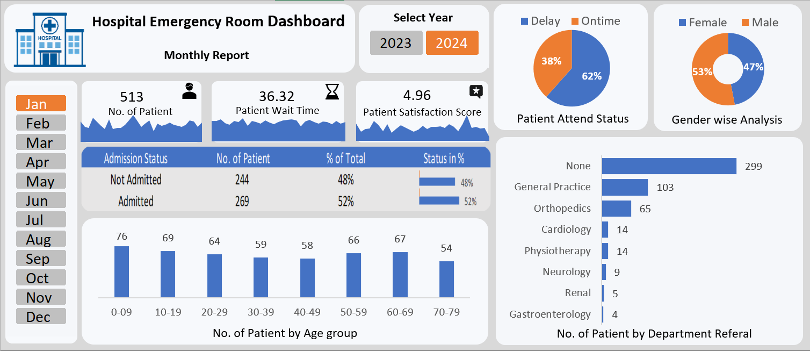

# 🏥 Hospital Emergency Room Dashboard (Excel)

An interactive Microsoft Excel dashboard designed to analyze Emergency Room (ER) operations and visualize key healthcare performance metrics. This project transforms raw patient data into actionable insights using Excel's analytical and visualization capabilities.

---

## 📌 Project Overview

The Hospital Emergency Room Dashboard provides a comprehensive analysis of emergency room performance, enabling stakeholders to monitor patient flow, waiting times, admissions, demographics, referrals, and patient satisfaction through interactive visualizations.

This project demonstrates how Microsoft Excel can be used as a Business Intelligence tool for healthcare analytics and operational reporting.

---

## 🎯 Business Objectives

- Monitor emergency room patient volume.
- Analyze patient waiting times.
- Evaluate admission and discharge trends.
- Track patient satisfaction.
- Analyze patient demographics.
- Identify referral patterns across hospital departments.

---

## 📊 Dashboard Features

- 📅 Interactive Month & Year Slicers
- 📈 KPI Cards with Trend Sparklines
- 👥 Total Patients
- ⏱ Average Wait Time
- ⭐ Patient Satisfaction Score
- 🚑 Patient Attendance Status
- 🏥 Admission Status Analysis
- 👨‍👩‍👧 Gender Distribution
- 🎂 Age Group Analysis
- 🔬 Department Referral Analysis

---

## 🛠 Tools & Technologies

- Microsoft Excel
- Power Query
- Power Pivot
- DAX
- Pivot Tables
- Pivot Charts
- Slicers
- Conditional Formatting
- Data Visualization

---

## 📐 DAX Calculations

The dashboard uses DAX calculated columns in **Power Pivot** to support demographic analysis and performance monitoring.

### Age Group

```DAX
=IF([Patient Age]>=70,"70-79",
IF([Patient Age]>=60,"60-69",
IF([Patient Age]>=45,"45-59",
IF([Patient Age]>=30,"30-44",
IF([Patient Age]>=15,"15-29",
IF([Patient Age]>=5,"05-14","0-4"))))))
```

### Patient Attendance Status

```DAX
=IF([Patient Waittime]<30,"Within Time","Delay")
```

---

## 📈 Key Insights

- Most patients were attended within the target response time.
- Patient admissions and non-admissions were nearly balanced.
- Adults accounted for the majority of emergency room visits.
- General Practice received the highest number of patient referrals.
- Patient satisfaction remained consistently high throughout the reporting period.

---

## 💼 Skills Demonstrated

- Data Cleaning
- Data Transformation
- Data Modeling
- DAX Calculations
- KPI Development
- Interactive Dashboard Design
- Healthcare Data Analysis
- Business Intelligence
- Data Visualization

---

## 📂 Repository Structure

```text
hospital-emergency-room-excel-dashboard/
│
├── README.md
├── Hospital_Emergency_Room_Dashboard.png
├── Hospital_Emergency_Room_Dashboard.pptx
└── Hospital_Emergency_Room_Data.csv
```

---

## 📷 Dashboard Preview



---

## 📁 Dataset

The project uses a hospital emergency room dataset containing patient demographics, visit details, wait times, admission status, referrals, and satisfaction scores.

---

## 👩‍💻 Author

**Somya Singhal**

Aspiring Data Analyst | SQL | Excel | Power BI | Data Visualization
